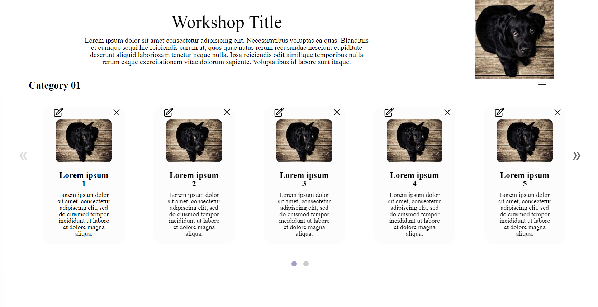
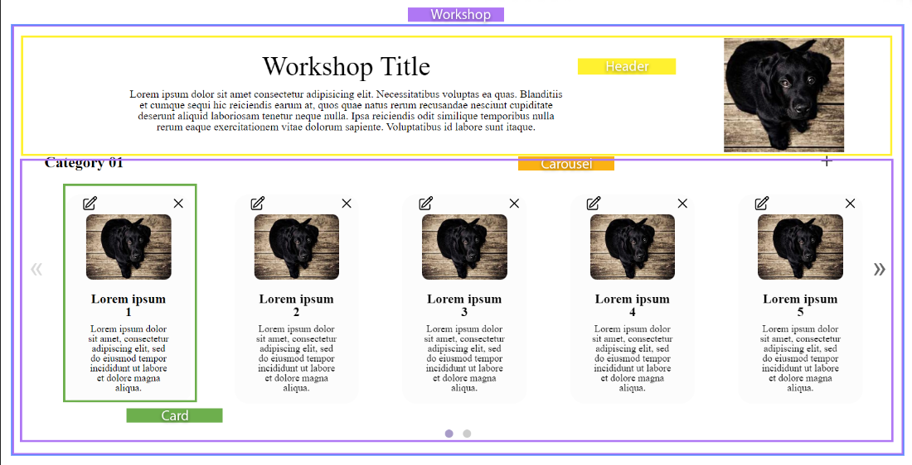
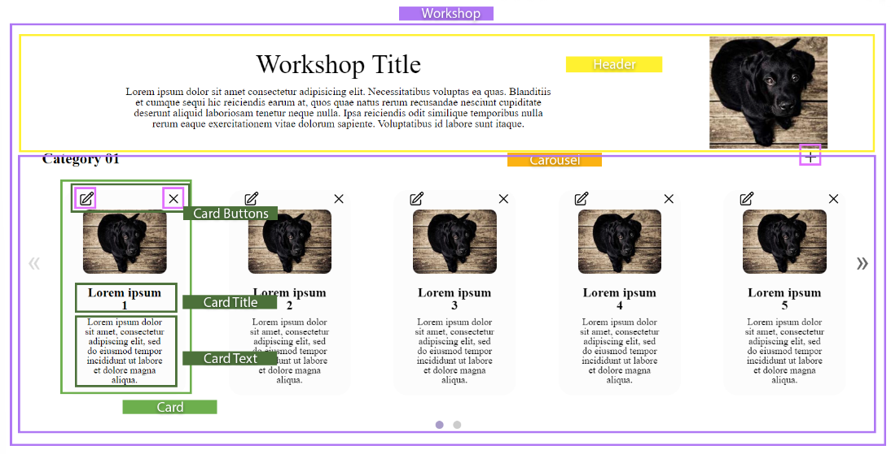

# Code Along: Thinking in React[#](https://ed.devmountain.com/materials/ogptlh2/exercises/wb-thinking-react/#code-along-thinking-in-react)

To build effective React apps, you’ll need to change how you think about your UI designs and your application architecture. In this code along, you’ll practice thinking in React: breaking UI into components, building visual states for each, and connecting them together so data flows through them.

## **Setup[#](https://ed.devmountain.com/materials/ogptlh2/exercises/wb-thinking-react/#setup)**

Run the command below to download the starter code.

```node
npm create vite@latest
```

Navigate to the project folder and use the following commands to install dependencies and open the project in VS Code. https://github.com/kevinfarrugia/react-glider

```node
npm install
npm i react-glider
code .
```

Delete all the contents of index.css, app.css. app.jsx then use [CSS Reset](https://meyerweb.com/eric/tools/css/reset/) and add that code to inde.css. In main.jsx, add the css import for Glider: `import "glider-js/glider.min.css";`

## **Project overview

As a web developer at Mountain Consulting, Inc. and your current project is an internal tool to create invoices for your clients.

### What you’re building

You’re working alongside the back end team and design team in order to develop the tool as a React app.

The back end team will serve invoice data through a JSON API. They’ve given you a mockup of the data so you know what to expect from the server:

```js
const topicData = {
  categoryName: "Category 01 Title",
  categoryDescription: "categoryDescription lorem ipsum dolor sit amet consectetur adipisicing elit. Necessitatibus voluptas ea quas. Blanditiis et cumque sequi hic reiciendis earum at, quos quae natus rerum recusandae nesciunt cupiditate deserunt aliquid laboriosam tenetur neque nulla. Ipsa reiciendis odit similique temporibus nulla rerum eaque exercitationem vitae dolorum sapiente. Voluptatibus id labore sunt itaque.",
  categoryImg: "https://picsum.photos/seed/picsum/300/300?grayscale",
  categoryData: [
    {
      id: 0,
      workshopName: "Lorem ipsum",
      workshopDescription:
        "Lorem ipsum dolor sit amet, consectetur adipiscing elit. Sed do eiusmod tempor incididunt ut labore et dolore magna aliqua. Ut enim ad minim veniam, quis nostrud exercitation ullamco laboris nisi ut aliquip ex ea commodo consequat. Duis aute irure dolor in reprehenderit in voluptate velit esse cillum dolore eu fugiat nulla pariatur. Excepteur sint occaecat cupidatat non proident, sunt in culpa qui officia deserunt mollit anim id est laborum.",
      workshopShortDescription:
        "Lorem ipsum dolor sit amet, consectetur adipiscing elit, sed do eiusmod tempor incididunt ut labore et dolore magna aliqua.",
      workshopImage: "https://picsum.photos/id/237/300/200",
    },
    {
      id: 1,
      workshopName: "Lorem ipsum",
      workshopDescription:
        "Lorem ipsum dolor sit amet, consectetur adipiscing elit. Sed do eiusmod tempor incididunt ut labore et dolore magna aliqua. Ut enim ad minim veniam, quis nostrud exercitation ullamco laboris nisi ut aliquip ex ea commodo consequat. Duis aute irure dolor in reprehenderit in voluptate velit esse cillum dolore eu fugiat nulla pariatur. Excepteur sint occaecat cupidatat non proident, sunt in culpa qui officia deserunt mollit anim id est laborum.",
      workshopShortDescription:
        "Lorem ipsum dolor sit amet, consectetur adipiscing elit, sed do eiusmod tempor incididunt ut labore et dolore magna aliqua.",
      workshopImage: "https://picsum.photos/id/237/300/200",
    },
    {
      id: 2,
      workshopName: "Lorem ipsum",
      workshopDescription:
        "Lorem ipsum dolor sit amet, consectetur adipiscing elit. Sed do eiusmod tempor incididunt ut labore et dolore magna aliqua. Ut enim ad minim veniam, quis nostrud exercitation ullamco laboris nisi ut aliquip ex ea commodo consequat. Duis aute irure dolor in reprehenderit in voluptate velit esse cillum dolore eu fugiat nulla pariatur. Excepteur sint occaecat cupidatat non proident, sunt in culpa qui officia deserunt mollit anim id est laborum.",
      workshopShortDescription:
        "Lorem ipsum dolor sit amet, consectetur adipiscing elit, sed do eiusmod tempor incididunt ut labore et dolore magna aliqua.",
      workshopImage: "https://picsum.photos/id/237/300/200",
    },
    {
      id: 3,
      workshopName: "Lorem ipsum",
      workshopDescription:
        "Lorem ipsum dolor sit amet, consectetur adipiscing elit. Sed do eiusmod tempor incididunt ut labore et dolore magna aliqua. Ut enim ad minim veniam, quis nostrud exercitation ullamco laboris nisi ut aliquip ex ea commodo consequat. Duis aute irure dolor in reprehenderit in voluptate velit esse cillum dolore eu fugiat nulla pariatur. Excepteur sint occaecat cupidatat non proident, sunt in culpa qui officia deserunt mollit anim id est laborum.",
      workshopShortDescription:
        "Lorem ipsum dolor sit amet, consectetur adipiscing elit, sed do eiusmod tempor incididunt ut labore et dolore magna aliqua.",
      workshopImage: "https://picsum.photos/id/237/300/200",
    },
    {
      id: 4,
      workshopName: "Lorem ipsum",
      workshopDescription:
        "Lorem ipsum dolor sit amet, consectetur adipiscing elit. Sed do eiusmod tempor incididunt ut labore et dolore magna aliqua. Ut enim ad minim veniam, quis nostrud exercitation ullamco laboris nisi ut aliquip ex ea commodo consequat. Duis aute irure dolor in reprehenderit in voluptate velit esse cillum dolore eu fugiat nulla pariatur. Excepteur sint occaecat cupidatat non proident, sunt in culpa qui officia deserunt mollit anim id est laborum.",
      workshopShortDescription:
        "Lorem ipsum dolor sit amet, consectetur adipiscing elit, sed do eiusmod tempor incididunt ut labore et dolore magna aliqua.",
      workshopImage: "https://picsum.photos/id/237/300/200",
    },
    {
      id: 5,
      workshopName: "Lorem ipsum",
      workshopDescription:
        "Lorem ipsum dolor sit amet, consectetur adipiscing elit. Sed do eiusmod tempor incididunt ut labore et dolore magna aliqua. Ut enim ad minim veniam, quis nostrud exercitation ullamco laboris nisi ut aliquip ex ea commodo consequat. Duis aute irure dolor in reprehenderit in voluptate velit esse cillum dolore eu fugiat nulla pariatur. Excepteur sint occaecat cupidatat non proident, sunt in culpa qui officia deserunt mollit anim id est laborum.",
      workshopShortDescription:
        "Lorem ipsum dolor sit amet, consectetur adipiscing elit, sed do eiusmod tempor incididunt ut labore et dolore magna aliqua.",
      workshopImage: "https://picsum.photos/id/237/300/200",
    },
    {
      id: 6,
      workshopName: "Lorem ipsum",
      workshopDescription:
        "Lorem ipsum dolor sit amet, consectetur adipiscing elit. Sed do eiusmod tempor incididunt ut labore et dolore magna aliqua. Ut enim ad minim veniam, quis nostrud exercitation ullamco laboris nisi ut aliquip ex ea commodo consequat. Duis aute irure dolor in reprehenderit in voluptate velit esse cillum dolore eu fugiat nulla pariatur. Excepteur sint occaecat cupidatat non proident, sunt in culpa qui officia deserunt mollit anim id est laborum.",
      workshopShortDescription:
        "Lorem ipsum dolor sit amet, consectetur adipiscing elit, sed do eiusmod tempor incididunt ut labore et dolore magna aliqua.",
      workshopImage: "https://picsum.photos/id/237/300/200",
    },
    {
      id: 7,
      workshopName: "Lorem ipsum",
      workshopDescription:
        "Lorem ipsum dolor sit amet, consectetur adipiscing elit. Sed do eiusmod tempor incididunt ut labore et dolore magna aliqua. Ut enim ad minim veniam, quis nostrud exercitation ullamco laboris nisi ut aliquip ex ea commodo consequat. Duis aute irure dolor in reprehenderit in voluptate velit esse cillum dolore eu fugiat nulla pariatur. Excepteur sint occaecat cupidatat non proident, sunt in culpa qui officia deserunt mollit anim id est laborum.",
      workshopShortDescription:
        "Lorem ipsum dolor sit amet, consectetur adipiscing elit, sed do eiusmod tempor incididunt ut labore et dolore magna aliqua.",
      workshopImage: "https://picsum.photos/id/237/300/200",
    },
    {
      id: 8,
      workshopName: "Lorem ipsum",
      workshopDescription:
        "Lorem ipsum dolor sit amet, consectetur adipiscing elit. Sed do eiusmod tempor incididunt ut labore et dolore magna aliqua. Ut enim ad minim veniam, quis nostrud exercitation ullamco laboris nisi ut aliquip ex ea commodo consequat. Duis aute irure dolor in reprehenderit in voluptate velit esse cillum dolore eu fugiat nulla pariatur. Excepteur sint occaecat cupidatat non proident, sunt in culpa qui officia deserunt mollit anim id est laborum.",
      workshopShortDescription:
        "Lorem ipsum dolor sit amet, consectetur adipiscing elit, sed do eiusmod tempor incididunt ut labore et dolore magna aliqua.",
      workshopImage: "https://picsum.photos/id/237/300/200",
    },
    {
      id: 9,
      workshopName: "Lorem ipsum",
      workshopDescription:
        "Lorem ipsum dolor sit amet, consectetur adipiscing elit. Sed do eiusmod tempor incididunt ut labore et dolore magna aliqua. Ut enim ad minim veniam, quis nostrud exercitation ullamco laboris nisi ut aliquip ex ea commodo consequat. Duis aute irure dolor in reprehenderit in voluptate velit esse cillum dolore eu fugiat nulla pariatur. Excepteur sint occaecat cupidatat non proident, sunt in culpa qui officia deserunt mollit anim id est laborum.",
      workshopShortDescription:
        "Lorem ipsum dolor sit amet, consectetur adipiscing elit, sed do eiusmod tempor incididunt ut labore et dolore magna aliqua.",
      workshopImage: "https://picsum.photos/id/237/300/200",
    },
  ],
};

export default topicData;


export default topicData;

```

The design team has provided a mockup of the UI design:



The rest is in your hands! You’ll follow a general framework for building React apps to complete the task.

## Thinking in React

React is hard—in order to build successful apps, you need to *think in React*. This can take some getting used to. The steps in this framework will help you think in React so you can build apps more quickly and with less bugs.

### Steps for building React apps

1. Start with a data mockup and UI mockup.
2. Based on the mockups, break the UI into components.
3. Build a static version in React.
4. Figure out what needs to go in state.
5. Decide where state should live.
6. Add inverse data flow so state changes based on user input.

You’ve already done the first step. Time to tackle the next!

## **Break UI into a component hierarchy

Based on the UI mockup, draw boxes around the components you need to implement and give them names.

### Identifying components

One way to think about splitting up a design into components is to treat them like you would any other function or object. The [single-responsibility principle](https://en.wikipedia.org/wiki/Single-responsibility_principle)— a software design principle—is a good place to start. It says that a function or component should only do one thing. Following this principle means decomposing large components into smaller subcomponents.

There are four types of components in this mockup:



- `Workshop` contains the entire app.
- `Header` displays the table header.
    - It might be overkill to make this a subcomponent since it’s pretty simple, but following the single-responsibility principle will make it easier to add complexity should project requirements change. You can always decide to include this as part of the `Workshop` component later, during the final stages of the project.
- `Carousel` Contain the Glider component and map all the cards
- `Card` Show information about a workshop and buttons to delete and edit

We can break the `Card` component down even further:



- `CardButtonsButtons` allows users to toggle between *normal mode* and *edit mode*.
    - In **normal mode**, the Delete button will remove the card and the Edit button will put the row in edit mode.
    - In **edit mode**, users will be able to edit the information in each card and press the Save button to save their changes.
- `CardTitle`, and `CardText` display the data from each card. In edit mode, they’ll display a text input used to update the data.

### Organize components into a hierarchy

Now that you’ve decided on your components, arrange them in a hierarchy so you have an outline of parent components and their children. You may want to copy this hierarchy into your own notes or project repo so you can keep track of your progress and organize your work.

- `Workshop`
    - `Header`
    - `Carousel`
        - `Card`
            - `CardTitle`
            - `CardText`
            - `CardButtons`
                - `Pencil`
                - `Delete`
        - `Add`
    

## **Build a static version of the app[#](https://ed.devmountain.com/materials/ogptlh2/exercises/wb-thinking-react/#build-a-static-version-of-the-app)**

In React, a ***static*** app only renders UI without adding interactivity. Building a static app requires a lot of *typing* and no thinking, but adding interactivity requires a lot of *thinking* and not so much typing. That’s why it’s easier to start with a static app and then add interactivity later.

| Item | Link |
| --- | --- |
| Pencil | [Link](https://www.flaticon.com/free-icon/pencil_1828911) |
| Close | [Link](https://www.flaticon.com/free-icon/delete-button_11240035?term=close+button&page=1&position=14&origin=search&related_id=11240035) |
| SVG | [Link](https://heroicons.com/) |

note for diego, sync branches 01 - 03 to changes made on 04 then create docs
